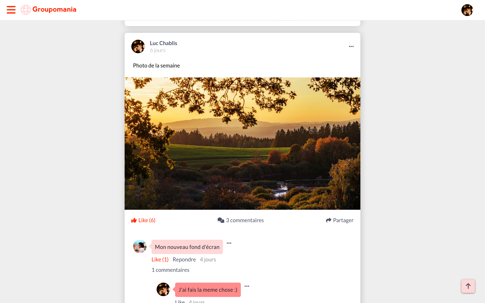
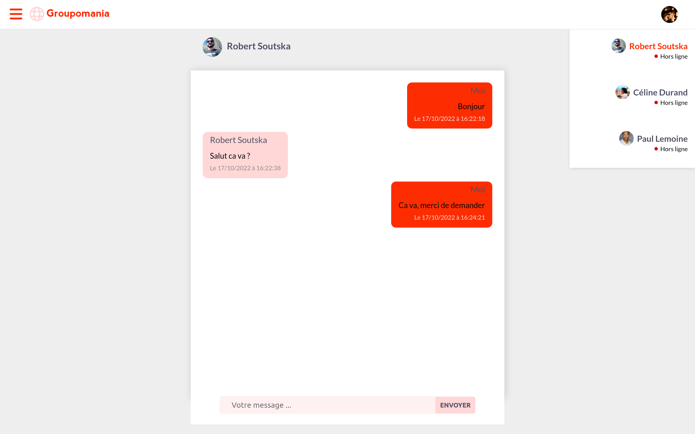
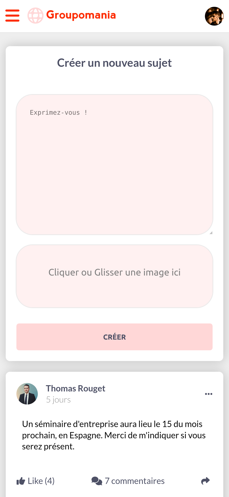
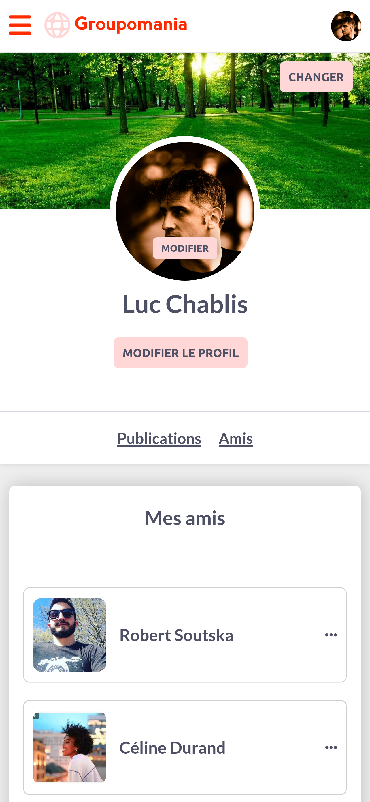

# Groupomania

Groupomania est un reseau social fictif réalisé avec React, sass pour le front-end, node js et express pour le back-end et Mysql pour la base de donnée.

## Instruction

[Briefing](./assets/instructions/instruction.pdf)

[Cahier des charges](./assets/instructions/Cahier+des+charges.pdf)

## Screenshot

## Lancer le projet

Lancer le serveur back en premier via "npm start", depuis le dossier back, pour qu' il soit utilisé via localhost:3000, puis le serveur react depuis le dossier front avec npm start.